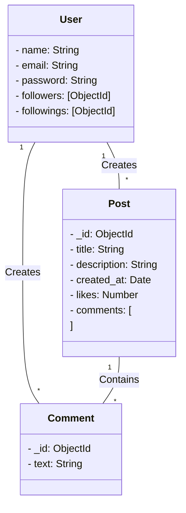
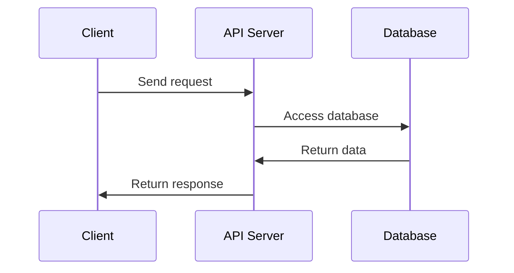

<p align="left">  </p>

# Social Media Platform API

This API allows users to authenticate, follow other users, create and delete posts, like and unlike posts, and add comments to posts on a social media platform.



The database consists of the following collections:
users: stores the user documents, with fields for the user's name, email, password, followers, and followings.

    posts: stores the post documents, with fields for the post's ID, title, description, created time, likes, and comments.

# Code Summary

The API is built using Node.js and Express.js, and connects to a MongoDB database for data storage.

The following endpoints are implemented:

    1. POST /api/authenticate: performs user authentication and returns a JWT token.

    2. POST /api/follow/{id}: follows a user with the given ID.

    3. POST /api/unfollow/{id}: unfollows a user with the given ID.

    4. GET /api/user: retrieves the authenticated user's profile.

    5. POST /api/posts/: creates a new post.

    6. DELETE /api/posts/{id}: deletes a post with the given ID.

    7. POST /api/like/{id}: likes a post with the given ID.

    8. POST /api/unlike/{id}: unlikes a liked post with the given ID.

    9. POST /api/comment/{id}: adds a comment to a post with the given ID.

    10. GET /api/posts/{id}: retrieves a single post with the given ID.

    11. GET /api/all_posts: retrieves all posts created by the authenticated user.

# Data Flow Diagram



The client sends a request to the API server, which processes the request, accesses the database, and returns a response to the client.

```bash
project/
├── config/
│ ├── db.js (MongoDB connection configuration)
│ ├── jwt.js (JWT configuration)
│ └── index.js (Project configuration)
├── controllers/
│ ├── auth.js (API endpoint functiоns fоr user authentication)
│ ├── follow.js (API endpoint functiоns fоr following/unfollowing usеrs)
│ ├── post.js (API endpoint functiоns fоr creating/deleting posts)
│ ├── like.js (API endpoint functiоns fоr liking/unliking posts)
│ └── comment.js (API endpoint functiоns fоr commenting on posts)
├── models/
│ ├── user.js (Mongoose model fоr the Users collection)
│ └── post.js (Mongoose model fоr the Posts collection)
├── routes/
│ ├── auth.js (ExpressJS route fоr /api/authenticate)
│ ├── follow.js (ExpressJS route fоr /api/follow/_)
│ ├── post.js (ExpressJS route fоr /api/posts/_)
│ ├── like.js (ExpressJS route fоr /api/like/_)
│ └── comment.js (ExpressJS route fоr /api/comment/_)
├── tеst/ (directory fоr API tеst cases)
├── .gitignore (list of files to ignore when pushing to Git)
├── package.json (project dependencies and scripts)
└── server.js (entry point fоr the API server)
```

# Requirements

1. NodeJS (v16 or higher) for running natively.
2. Docker and Docker Compose

# Tech Stack

1. [NodeJS](https://nodejs.org/en/) for server side.
2. [Docker](https://www.docker.com/) for containerization.
3. [Docker Compose](https://docs.docker.com/compose/) for container orchestration.
4. [MongoDB](https://www.mongodb.com/) for database.

# Steps to run the App

Set up .env variables

```
# write env variables to file

# server config
PORT = 7001
ENV = dev

# database config
MONGO_DATABASE  = social-media
MONGO_PASSWORD = password
MONGO_PORT = 27017
MONGO_USER = admin
MONGO_URL = localhost

# jwt config
JWT_SECRET = secret
JWT_EXPIRES_IN = 1d
```

## Start the docker container

```bash
docker-compose up -d
```

<h3 align="left">Connect with me:</h3>
<p align="left">
<a href="https://linkedin.com/in/bharat-chandwani" target="blank"></a>
<a href="https://www.codechef.com/users/anonymous_holm" target="blank"></a>
<a href="https://www.leetcode.com/bharatchandwani" target="blank"></a>
</p>

<h3 align="left">Languages and Tools:</h3>
<p align="left"> <a href="https://www.docker.com/" target="_blank" rel="noreferrer">  </a> <a href="https://expressjs.com" target="_blank" rel="noreferrer">  </a> <a href="https://git-scm.com/" target="_blank" rel="noreferrer">  </a> <a href="https://developer.mozilla.org/en-US/docs/Web/JavaScript" target="_blank" rel="noreferrer">  </a> <a href="https://www.linux.org/" target="_blank" rel="noreferrer">  </a> <a href="https://mochajs.org" target="_blank" rel="noreferrer">  </a> <a href="https://www.mongodb.com/" target="_blank" rel="noreferrer">  </a> <a href="https://nodejs.org" target="_blank" rel="noreferrer">  </a> <a href="https://postman.com" target="_blank" rel="noreferrer">  </a> </p>
